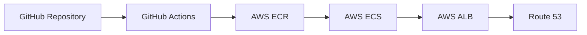

# CI/CD Documentation

This document outlines the Continuous Integration and Continuous Deployment (CI/CD) setup for the CV Matcher project using GitHub Actions and AWS.

## Infrastructure Overview



## AWS Resources

- **ECR (Elastic Container Registry)**: Stores Docker images
- **ECS (Elastic Container Service)**: Runs containerized application
- **ALB (Application Load Balancer)**: Handles traffic distribution
- **Route 53**: DNS management
- **S3**: Storage for uploaded files
- **CloudWatch**: Monitoring and logging
- **IAM**: Access management

## GitHub Actions Workflows

### 1. CI Pipeline (.github/workflows/ci.yml)

```yaml
name: CI Pipeline

on:
  push:
    branches: [ main, develop ]
  pull_request:
    branches: [ main, develop ]

jobs:
  test:
    runs-on: ubuntu-latest
    
    steps:
      - uses: actions/checkout@v3
      
      - name: Set up Python
        uses: actions/setup-python@v4
        with:
          python-version: '3.12'
          cache: 'pip'
          
      - name: Create virtual environment
        run: make venv/create
          
      - name: Install dependencies
        run: |
          make venv/install/all
          
      - name: Run linters
        run: make lint
          
      - name: Run tests
        env:
          PYTHONPATH: ${PYTHONPATH}:.
        run: make test
          
      - name: Upload coverage reports
        uses: codecov/codecov-action@v3
        with:
          file: ./coverage.xml
          fail_ci_if_error: true

```

The CI pipeline consists of three main jobs:

1. **Test Job**:
   - Sets up Python 3.12 environment with pip caching
   - Creates virtual environment using Makefile
   - Installs all dependencies (including dev dependencies)
   - Runs code linting (flake8, black, isort)
   - Executes test suite with coverage reporting
   - Uploads coverage reports to Codecov

2. **Docker Build Job**:
   - Runs only on push events
   - Depends on successful test and security scan
   - Uses Docker Buildx for efficient builds
   - Builds image using Makefile command

### 2. CD Pipeline (.github/workflows/cd.yml)

```yaml
name: CD Pipeline

on:
  push:
    branches: [ main ]
    tags: [ 'v*' ]

jobs:
  deploy:
    runs-on: ubuntu-latest
    steps:
      - uses: actions/checkout@v3
      
      - name: Configure AWS credentials
        uses: aws-actions/configure-aws-credentials@v2
        with:
          aws-access-key-id: ${{ secrets.AWS_ACCESS_KEY_ID }}
          aws-secret-access-key: ${{ secrets.AWS_SECRET_ACCESS_KEY }}
          aws-region: ${{ secrets.AWS_REGION }}
          
      - name: Login to Amazon ECR
        id: login-ecr
        uses: aws-actions/amazon-ecr-login@v1
        
      - name: Build and push Docker image
        env:
          ECR_REGISTRY: ${{ steps.login-ecr.outputs.registry }}
          ECR_REPOSITORY: cv_matcher
          IMAGE_TAG: ${{ github.sha }}
        run: |
          docker build -t $ECR_REGISTRY/$ECR_REPOSITORY:$IMAGE_TAG .
          docker push $ECR_REGISTRY/$ECR_REPOSITORY:$IMAGE_TAG
          
      - name: Deploy to ECS
        uses: aws-actions/amazon-ecs-deploy-task-definition@v1
        with:
          task-definition: .aws/task-definition.json
          service: cv-matcher-service
          cluster: cv-matcher-cluster
          wait-for-service-stability: true
```

## AWS Configuration Files

### 1. Task Definition (.aws/task-definition.json)

```json
{
  "family": "cv-matcher",
  "networkMode": "awsvpc",
  "requiresCompatibilities": ["FARGATE"],
  "cpu": "256",
  "memory": "512",
  "containerDefinitions": [
    {
      "name": "cv-matcher",
      "image": "<ECR_URI>:latest",
      "portMappings": [
        {
          "containerPort": 8000,
          "protocol": "tcp"
        }
      ],
      "logConfiguration": {
        "logDriver": "awslogs",
        "options": {
          "awslogs-group": "/ecs/cv-matcher",
          "awslogs-region": "us-east-1",
          "awslogs-stream-prefix": "ecs"
        }
      }
    }
  ]
}
```

## Environment Variables

### GitHub Secrets Required

- `AWS_ACCESS_KEY_ID`
- `AWS_SECRET_ACCESS_KEY`
- `AWS_REGION`
- `APP_URL`
- `SLACK_CHANNEL_ID`
- `SLACK_BOT_TOKEN`

### AWS Parameter Store Variables

- `/cv-matcher/prod/DATABASE_URL`
- `/cv-matcher/prod/JWT_SECRET_KEY`
- `/cv-matcher/prod/S3_BUCKET_NAME`

## Deployment Process

1. **Development**
   - Developers work on feature branches
   - Create pull requests to `develop` branch
   - CI pipeline runs tests and checks

2. **Staging**
   - Merge to `develop` triggers deployment to staging
   - Testing in staging environment
   - Manual QA verification

3. **Production**
   - Create release tag (e.g., `v1.0.0`)
   - Tag triggers production deployment
   - Blue-green deployment strategy

## Monitoring and Alerts

### CloudWatch Alarms

```yaml
- CPU Utilization > 80%
- Memory Utilization > 80%
- HTTP 5xx Errors > 1%
- Response Time > 1s
- Failed ECS Task Count > 0
```

### Logging

- Application logs sent to CloudWatch Logs
- ECS container logs
- ALB access logs stored in S3

## Rollback Procedure

1. **Automatic Rollback**
   - Failed deployment triggers automatic rollback
   - Previous task definition version restored

2. **Manual Rollback**
   ```bash
   aws ecs update-service --cluster cv-matcher-cluster \
     --service cv-matcher-service \
     --task-definition cv-matcher:<previous-version>
   ```

## Security Measures

1. **Infrastructure**
   - VPC with private subnets
   - Security groups for service isolation
   - AWS WAF for API protection

2. **Application**
   - Secrets in AWS Parameter Store
   - IAM roles with minimal permissions
   - Regular security scans

## Scaling Configuration

### Auto Scaling

```json
{
  "targetValue": 75.0,
  "scaleOutCooldown": 300,
  "scaleInCooldown": 300,
  "targetTrackingMetric": "ECSServiceAverageCPUUtilization"
}
```

## Disaster Recovery

1. **Backup Strategy**
   - S3 bucket versioning
   - ECR image immutability

2. **Recovery Plan**
   - Documentation in runbooks 