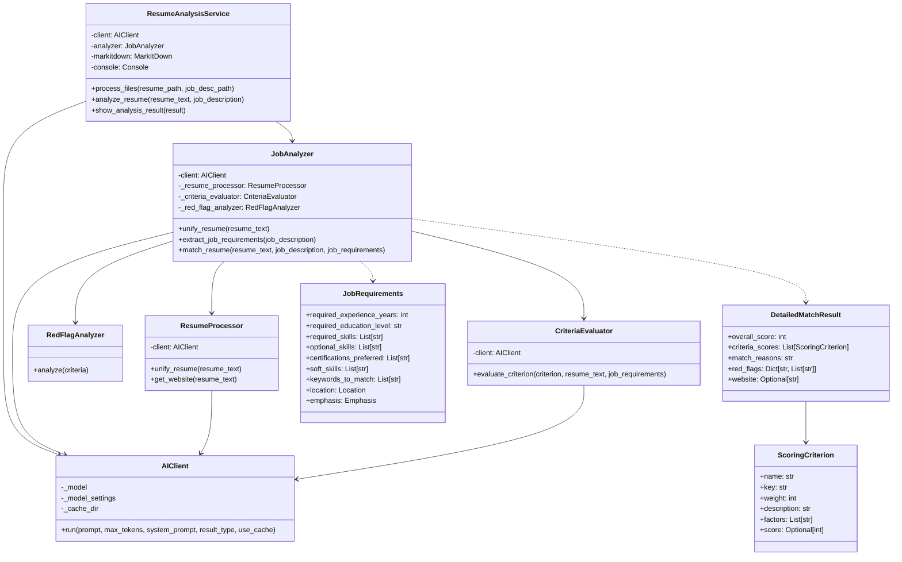

# CV Matcher Project Plan

## Project Overview
CV Matcher is a tool designed to match job descriptions with candidate CVs/resumes using advanced text analysis and matching algorithms.

## Project Structure
```
cv_matcher/
├── README.md           # Project documentation and setup instructions
├── Dockerfile         # Container configuration
├── requirements.txt   # Python dependencies
├── src/
│   ├── __init__.py
│   ├── main.py       # Application entry point
│   ├── api/          # API endpoints
│   ├── core/         # Core matching logic
│   ├── models/       # Data models
│   └── utils/        # Utility functions
├── tests/            # Test suite
└── docs/             # Additional documentation
```

## Technical Stack
- **Backend**: Python 3.12+
- **API Framework**: FastAPI
- **Text Processing**: MarkItDown
- **ML/AI**: Pydantic AI
- **Docker**: Containerization
- **Testing**: pytest

## Core Features
1. **CV Processing**
   - PDF/DOCX parsing
   - Text extraction
   - Structure recognition
   - Skills extraction
   - Experience mapping

2. **Job Description Processing**
   - Requirements extraction
   - Skills identification
   - Experience level detection
   - Must-have vs. nice-to-have classification

3. **Matching Engine**
   - Skills matching
   - Experience matching
   - Education matching
   - Scoring system
   - Ranking algorithm

4. **API Endpoints**
   - Upload CV
   - Submit job description
   - Get matching results
   - Manage candidates
   - Manage job postings

## Project Class Diagram

## Implementation Plan

### Phase 1: Setup and Basic Structure
1. Initialize project structure
2. Set up development environment
3. Configure Docker
4. Implement basic API structure
5. Set up database models

### Phase 2: Core Processing
1. Implement CV parsing
2. Implement job description parsing
3. Create basic text processing utilities
4. Set up initial matching logic

### Phase 3: Advanced Features
1. Implement ML-based matching
2. Add scoring system
3. Create ranking algorithm
4. Implement advanced filters

### Phase 4: API and Integration
1. Complete REST API endpoints
2. Add authentication
3. Implement rate limiting
4. Add API documentation

### Phase 5: Testing and Deployment
1. Write unit tests
2. Add integration tests
3. Set up CI/CD
4. Prepare production deployment


## Security Considerations
- Implement JWT authentication
- Secure file uploads
- Rate limiting
- Input validation
- Data encryption
- CORS configuration
- Environment variables for sensitive data

## Monitoring and Logging
- Request logging
- Error tracking
- Performance metrics
- API usage statistics
- System health monitoring

## Development Guidelines
1. Follow PEP 8 style guide
2. Write comprehensive docstrings
3. Maintain test coverage >80%
4. Use type hints
5. Regular code reviews
6. Version control best practices

## Deployment Strategy
1. Docker-based deployment
2. Scalable architecture
3. Load balancing
4. Monitoring setup
5. CI/CD pipeline

## Future Enhancements
1. AI-powered matching improvements
2. Resume parsing accuracy
3. Additional file format support
4. Advanced analytics